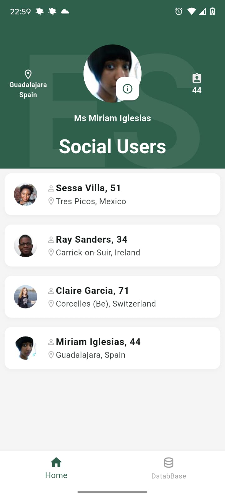
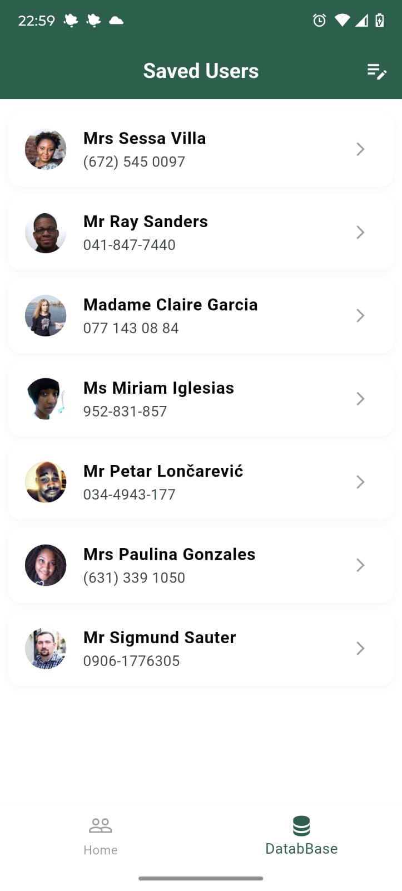
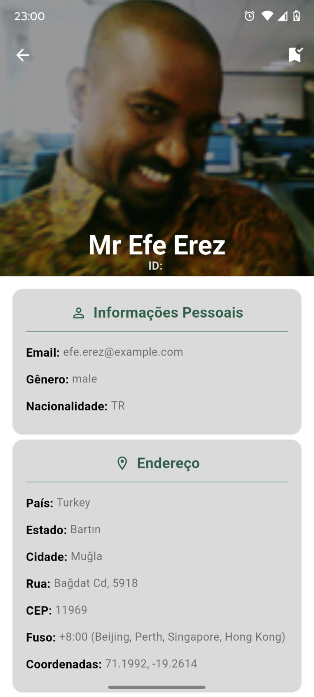
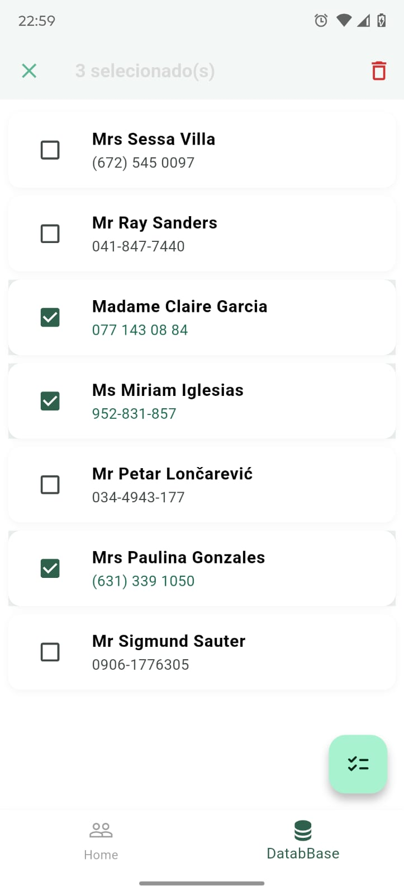

 <div align="center">
    
    <p>Face App</p>
  </div>


## Descrição 📖

Este projeto é um aplicativo desenvolvido com Flutter, focado em consumir uma API externa de informações, aporveitadno o maximo do **Flutter** . Ele oferece uma interface de usuário moderna e responsiva, projetada para proporcionar uma experiência intuitiva e eficiente aos usuários.

  <div align="center">
    
    
    
    
  </div>

## Estrutura do Projeto 📑

A estrutura do projeto segue as convenções padrão de um aplicativo Flutter, organizada para facilitar a manutenção e a escalabilidade:

```bash
lib/
├── core/                  # Camada central da aplicação, lógica de negócio compartilhada.
│   ├── models/            # Definição das classes de modelo (POO) representando os dados (ex: User).
│   ├── repository/        # Abstração do acesso aos dados (Interfaces como `IUserRepository`) e suas implementações (`UserRepositoryImpl`). Conecta os serviços à lógica de negócio.
│   └── services/          # Serviços específicos para tarefas de baixo nível.
│       ├── client/        # Lógica relacionada à comunicação com a API externa (requisições HTTP).
│       └── persistence/   # Lógica para salvar e recuperar dados localmente (ex: SharedPreferences).
│
├── utils/                 # Classes e funções utilitárias reutilizáveis em todo o app.
│   ├── enum/              # Definição de tipos enumerados (ex: ConnectivityStatus).
│   ├── connectivity_provider.dart # Provider (ChangeNotifier) para gerenciar o estado da conexão.
│   ├── const.dart         # Constantes globais da aplicação (cores, chaves, URLs base, etc.).
│   └── date_formater.dart # Classe utilitária para formatação de datas.
│
├── widgets/               # Widgets customizados e reutilizáveis pela UI (ex: `_AnimatedListItem`).
│
├── src/                   # Camada de apresentação e features específicas (telas).
│   ├── contacts/          # Feature: Tela de usuários salvos (persistidos). Contém `contact.dart`, `contact_view.dart`, `contact_view_model.dart`.
│   ├── details/           # Feature: Tela de detalhes de um usuário. Contém `details.dart`, `details_view.dart`, `details_view_model.dart`.
│   ├── home/              # Feature: Tela principal (Home). Contém `home.dart`, `home_view.dart`, `home_view_model.dart`.
│   ├── routes/            # Configuração da navegação (rotas nomeadas `AppRoutes`, classes de argumentos).
│   └── splash/            # Feature: Tela inicial de Splash com animação. Contém `splash.dart`, `splash_view.dart`, `splash_view_model.dart`.
│
├── main.dart              # Ponto de entrada da aplicação Flutter. Responsável pela inicialização, configuração de providers (injeção de dependência) e definição do MaterialApp.
│
└── test/                  # Pasta para testes unitários, de widgets e de integração. (Fora do `lib/`)
```

## Tecnologias Utilizadas 🛠

Este projeto foi construído utilizando as seguintes tecnologias e ferramentas:

- **Flutter**: Framework de UI para construir aplicativos compilados nativamente para celular, web e desktop a partir de uma única base de código.
- **Dart**: Linguagem de programação otimizada para clientes, desenvolvida pelo Google.
- **Gradle**: Sistema de automação de build para projetos Android.
- **Android SDK/NDK**: Ferramentas e bibliotecas para desenvolvimento Android nativo.
- **`intl` package**: Pacote Dart para internacionalização e localização, utilizado para formatação de datas e números.

## Pacotes e API Utilizados 📚

### API
* **[randomuser.me API](https://randomuser.me/api/)**: Utilizada para buscar dados aleatórios de usuários.

### Pacotes Flutter/Dart (Principais Dependências)
* **[provider](https://pub.dev/packages/provider)**: Para gerenciamento de estado e injeção de dependência.
* **[http](https://pub.dev/packages/http)**: Para realizar requisições HTTP à API.
* **[shared_preferences](https://pub.dev/packages/shared_preferences)**: Para persistência local de dados simples (usuários salvos).
* **[intl](https://pub.dev/packages/intl)**: Para formatação de datas e internacionalização.
* **[connectivity_plus](https://pub.dev/packages/connectivity_plus)**: Para verificar o status da conexão de rede (Wi-Fi, Dados Móveis, Offline).
* **[icons_plus](https://pub.dev/packages/icons_plus)**: (Opcional) Usado para fornecer uma variedade maior de ícones (Material Outlined/Rounded, Font Awesome, etc.).
* **[flutter_staggered_animations](https://pub.dev/packages/flutter_staggered_animations)**: (Opcional) Usado para adicionar animações à lista de forma simples.

## Rodar aplicação localmente 💻

Siga os passos abaixo para executar o projeto em seu ambiente de desenvolvimento após clonar o repositório:

Clone o Repositório:

```bash
git clone https://github.com/JoseGoncalvess/face_app.git
```

```bash
cd [NOME_DA_PASTA_DO_PROJETO]
```

Pré-requisitos:

Certifique-se de ter o Flutter SDK instalado e configurado corretamente em sua máquina. Você pode verificar sua instalação com:

```bash
flutter doctor
```

Tenha um emulador Android configurado ou um dispositivo físico Android/iOS conectado e reconhecido pelo Flutter (flutter devices).

Instale as Dependências:
Execute o comando para baixar todas as dependências do projeto listadas no pubspec.yaml:

```bash
flutter pub get
```

Execute o Aplicativo:
Com um dispositivo ou emulador ativo, execute o comando para compilar e rodar o aplicativo:

```bash
flutter run
```

O aplicativo deverá ser compilado e iniciado no dispositivo/emulador selecionado.

## Versão de Teste ✅

A versão de teste do aplicativo será disponibilizada em breve.

**Link para a versão de teste:**[Teste Face App](https://play.google.com/apps/internaltest/4701165045134993825)

Caso queira participar dos teste, basta entrar em contato.👻

## Desenvolvido por 👨‍💻

Este projeto foi desenvolvido por:

**[José Gonçalves ☕](https://github.com/JoseGoncalvess)**
